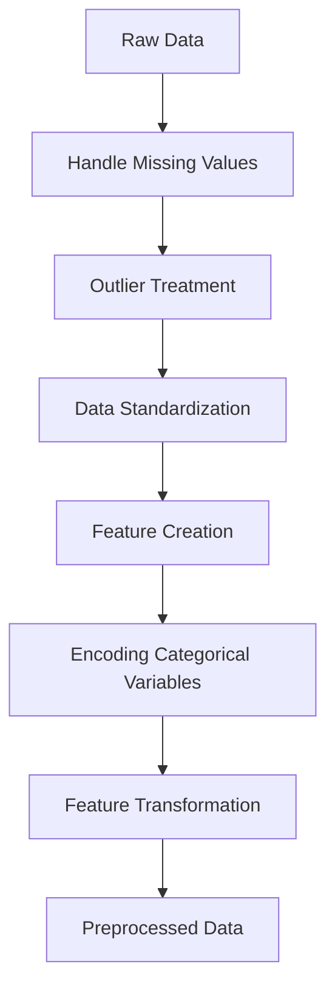

# Grocery Sales Prediction
https://grocergeniusaibasedsupermarketsalesprediction.streamlit.app/

[](https://opensource.org/licenses/MIT)
[](https://www.python.org/)
[](https://streamlit.io/)

---

## Table of Contents

- [Introduction](#introduction)
- [Technology Stack](#technology-stack)
- [Project Workflow](#project-workflow)
- [Data Preprocessing](#data-preprocessing)
- [Modeling](#modeling)
- [Inferencing](#inferencing)
- [Usage](#usage)
  - [Prerequisites](#prerequisites)
  - [Setup Instructions](#setup-instructions)
  - [Using the Application](#using-the-application)
- [Contributors](#contributors)
- [License](#license)
- [Acknowledgments](#acknowledgments)

---

## Introduction

Welcome to the **Grocery Sales Prediction** project! 

In today's competitive retail landscape, accurate sales forecasting is crucial for inventory management, resource allocation, and strategic planning. This project leverages machine learning to predict the sales of grocery items across various outlets, enabling businesses to make data-driven decisions and optimize their operations.

**Why is this important?**

- **Inventory Management**: Prevent overstocking or stockouts.
- **Pricing Strategies**: Adjust prices based on demand predictions.
- **Marketing Campaigns**: Target promotions effectively.

---

## Technology Stack

We have utilized a modern and robust technology stack to ensure scalability and performance:

- **Programming Language**: [Python 3.x](https://www.python.org/)
- **Data Manipulation**: [Pandas](https://pandas.pydata.org/), [NumPy](https://numpy.org/)
- **Data Visualization**: [Matplotlib](https://matplotlib.org/), [Seaborn](https://seaborn.pydata.org/)
- **Machine Learning**: [Scikit-learn](https://scikit-learn.org/stable/)
- **Model Persistence**: [Joblib](https://joblib.readthedocs.io/en/latest/)
- **Web Framework**: [Streamlit](https://streamlit.io/)
- **Version Control**: [Git](https://git-scm.com/)
- **Development Environment**: [Jupyter Notebooks](https://jupyter.org/)

---

## Project Workflow

Our project follows a structured workflow to ensure clarity and efficiency:

1. **Data Collection** 📊
   - Gather raw sales data from multiple grocery outlets.
2. **Data Preprocessing** 🛠️
   - Cleanse data, handle missing values, and prepare for modeling.
3. **Exploratory Data Analysis (EDA)** 🔍
   - Visualize data patterns and uncover insights.
4. **Feature Engineering** 🧪
   - Create new features and transform existing ones.
5. **Model Training** 🤖
   - Train machine learning models and fine-tune hyperparameters.
6. **Model Evaluation** 🏆
   - Assess model performance using appropriate metrics.
7. **Model Deployment** 🚀
   - Deploy the model using Streamlit for user interaction.
8. **Inferencing** 🔮
   - Generate predictions based on user inputs.

---

## Data Preprocessing

**"Data is the new oil."** — *Clive Humby*

To extract value from data, we performed meticulous preprocessing:

- **Handling Missing Values**:
  - *Item Weight*: Imputed using median values grouped by *Item Type*.
  - *Outlet Size*: Filled using mode values grouped by *Outlet Type*.
- **Outlier Detection and Treatment**:
  - Applied the **Interquartile Range (IQR)** method to cap outliers.
- **Data Standardization**:
  - Unified labels in *Item Fat Content* to ensure consistency.
- **Feature Creation**:
  - **Item Visibility Bins**: Categorized into 'Low', 'Medium', 'High'.
  - **Years Since Establishment**: Calculated operational years of outlets.
- **Encoding Categorical Variables**:
  - *One-Hot Encoding*: For nominal variables like *Item Type*.
  - *Ordinal Encoding*: For variables with an inherent order.
  - *Mean Target Encoding*: For *Outlet Identifier* based on mean sales.
- **Feature Transformation**:
  - Log transformation applied to *Item Visibility* to reduce skewness.

**Visual Overview of Preprocessing Steps:**



---

## Modeling

Our predictive modeling process is designed for accuracy and robustness:

- **Algorithm Selection**: **Random Forest Regressor**
  - **Reasons**:
    - Handles both linear and non-linear data.
    - Reduces overfitting through ensemble learning.
    - Captures complex feature interactions.
- **Model Training**:
  - Data split into training and validation sets.
  - Hyperparameters tuned using grid search.
- **Evaluation Metrics**:
  - **Mean Squared Error (MSE)**: Measures average squared difference.
  - **R-squared (R²)**: Indicates the proportion of variance explained.

**Feature Importance Plot:**

*An image showcasing the importance of each feature in the model can be placed here.*

---

## Inferencing

The deployed model is accessible through an interactive web application:

- **User Interface**: Built with **Streamlit** for a seamless experience.
- **Real-Time Predictions**: Users receive immediate feedback upon input.
- **Robust Error Handling**: Ensures smooth user interaction and guides users in case of invalid inputs.

---

## Usage

### Prerequisites

Ensure you have the following installed:

- **Python 3.x**
- **Python Libraries**:
  - `pandas`
  - `numpy`
  - `scikit-learn`
  - `joblib`
  - `streamlit`

### Setup Instructions

**Follow these steps to get the project up and running:**

1. **Clone the Repository**

   ```bash
   git clone https://github.com/yourusername/grocery_sales_prediction.git
   cd grocery_sales_prediction
   ```

2. **Create a Virtual Environment**

   ```bash
   python3 -m venv env
   source env/bin/activate  # For Windows: env\Scripts\activate
   ```

3. **Install Dependencies**

   ```bash
   pip install -r requirements.txt
   ```

4. **Directory Structure**

   Your project should have the following structure:

   ```
   grocery_sales_prediction/
   ├── data_alchemy/
   │   ├── raw/
   │   │   └── train.csv
   ├── model_factory/
   │   ├── models/
   │   ├── encoders/
   │   └── features/
   ├── codebase/
   │   ├── utils.py
   │   ├── training_script.py
   │   └── app.py
   └── README.md
   ```

5. **Place Your Data**

   - Copy your `train.csv` file into `data_alchemy/raw/`.

6. **Train the Model**

   ```bash
   cd codebase
   python training_script.py
   ```

   - This script will preprocess the data and train the model.

7. **Run the Streamlit App**

   ```bash
   streamlit run app.py
   ```

8. **Access the Application**

   - Open your web browser and navigate to `http://localhost:8501`.

### Using the Application

**Step-by-Step Guide:**

1. **Navigate to the Application**

   - Open your browser and go to `http://localhost:8501`.

2. **Input Features**

   - **Item Identifier**: Select from the dropdown.
   - **Item Weight**: Enter a value within the specified range.
   - **Item Fat Content**: Choose between 'Low Fat' and 'Regular'.
   - **Item Visibility**: Adjust using the slider.
   - **Item Type**: Select the appropriate category.
   - **Item MRP**: Enter the maximum retail price.
   - **Outlet Identifier**: Select the outlet code.
   - **Outlet Establishment Year**: Choose the year from the dropdown.
   - **Outlet Size**: Select the size category.
   - **Outlet Location Type**: Choose the location type.
   - **Outlet Type**: Select the type of outlet.

3. **Predict Sales**

   - Click the **"Predict"** button to generate the sales prediction.

4. **View Results**

   - The predicted sales figure will be displayed on the screen.

**Sample Screenshot of the Application:**

*Include a screenshot of the Streamlit app interface here.*

---

## Contributors

We extend our heartfelt gratitude to everyone who contributed to this project:

- **Mentor**: **Amal Salilan** ([amalsalilan](https://github.com/amalsalilan))
- **Aman** ([theamansyed](https://github.com/theamansyed))
- **Vrushika K Panchal** ([vrushika-k-panchal](https://github.com/vrushika-k-panchal))
- **Chetan** ([Chetanp717](https://github.com/Chetanp717))
- **Rimi** ([rs2103](https://github.com/rs2103))
- **Shilpa Manaji** ([Shilpa-Manaji](https://github.com/Shilpa-Manaji))
- **Tharun** ([Kottetharun-09](https://github.com/Kottetharun-09))
- **Sumithra** ([Sumithra-git](https://github.com/Sumithra-git))
- **Yanvi Arora** ([YanviAroraCS](https://github.com/YanviAroraCS))
- **Sayantan** ([SayanRony](https://github.com/SayanRony))
- **Muskan Asthana** ([muskan42](https://github.com/muskan42))
- **Purnima Pattnaik** ([Purnima07-sudo](https://github.com/Purnima07-sudo))
- **Rameswar Bisoyi** ([RB137](https://github.com/RB137))
- **Raunit** ([raunit45](https://github.com/raunit45))
- **Hima Mankanta** ([manu-vasamsetti](https://github.com/manu-vasamsetti))
- **Nuka Abhinay** ([NUKA-ABHINAY](https://github.com/NUKA-ABHINAY))
- **Anjan Kumar** ([Anjankumarkamalapur](https://github.com/Anjankumarkamalapur))

*Your contributions have been invaluable. Thank you for your dedication and hard work!* 🙌

---

## License

This project is licensed under the **MIT License** - see the [LICENSE](LICENSE) file for details.

---

## Acknowledgments

<!-- **Special Thanks**: To our mentor **Amal Salilan** for his guidance and support.-->
- **Open-Source Community**: For providing tools and resources that made this project possible.
- **You**: For taking the time to explore our project.

---

*Feel free to reach out for any queries or collaboration opportunities.*

**Contact**: [your-email@example.com](mailto:your-email@example.com)

---

*Made with ❤️ by the Grocery Sales Prediction Team.*
